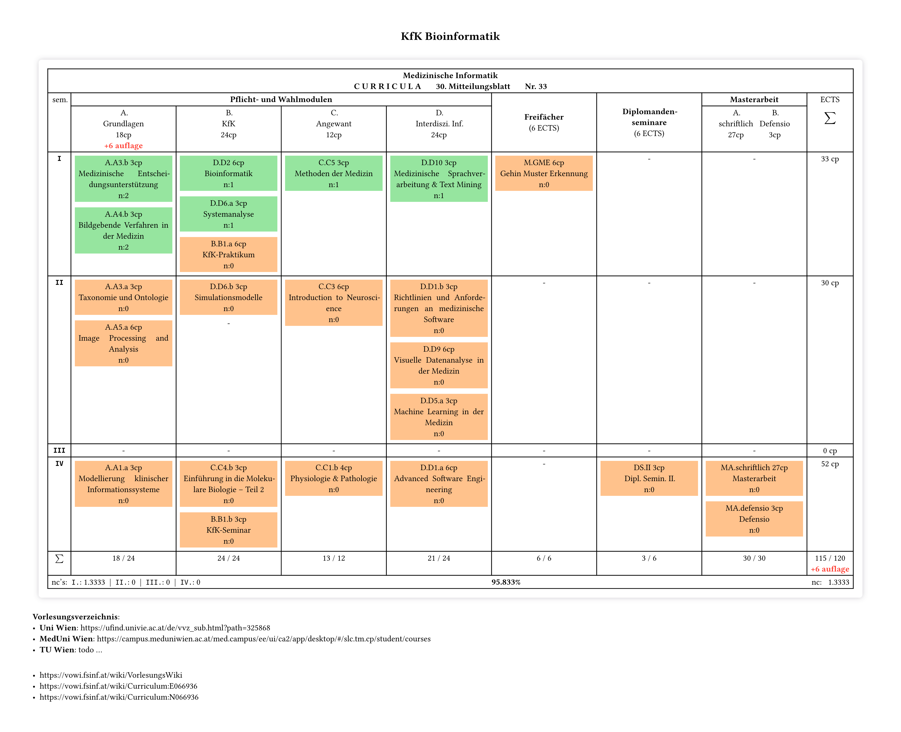

# curricula-med-inf-meduni-wien

### see: [pdf](./main.pdf)

<!-- ~~` -->

<!-- `~~ -->

> [!NOTE]
>
> This repository does **NOT** contain **a study programme plan**.
> It provides a way to **plan your own studies** and export this plan clearly and structurally as a PDF.
>
> To adjust the generated PDF document, please modify the first few lines of the TOML file,
> then use typst.app (locally via CLI or online) to generate the PDF.
>

#### https://www.meduniwien.ac.at/web/fileadmin/content/serviceeinrichtungen/studienabteilung/studierende/medizinische_informatik/pdf/30_Mitteilungsblatt_27062024_Curriculumaenderung_Medizinische_Informatik.pdf
