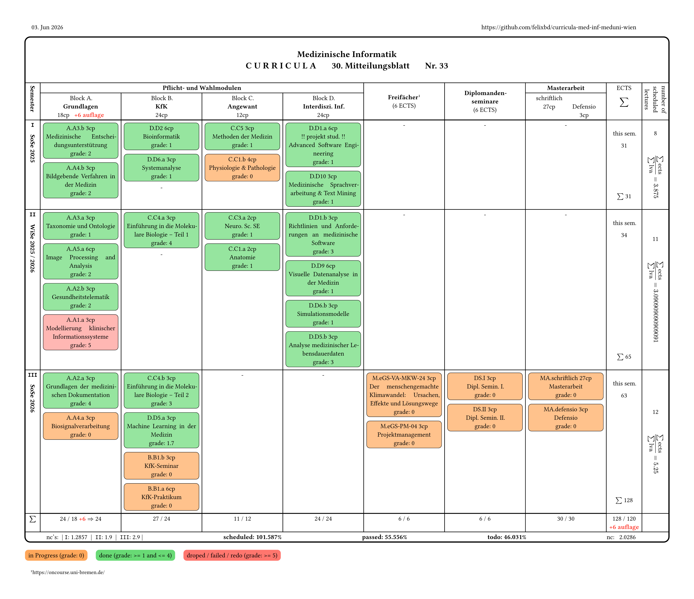
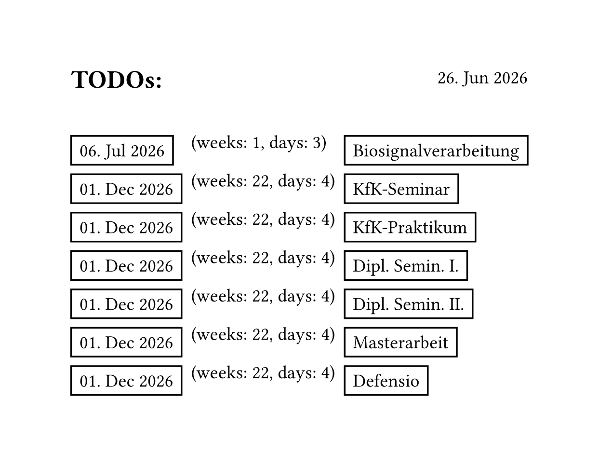
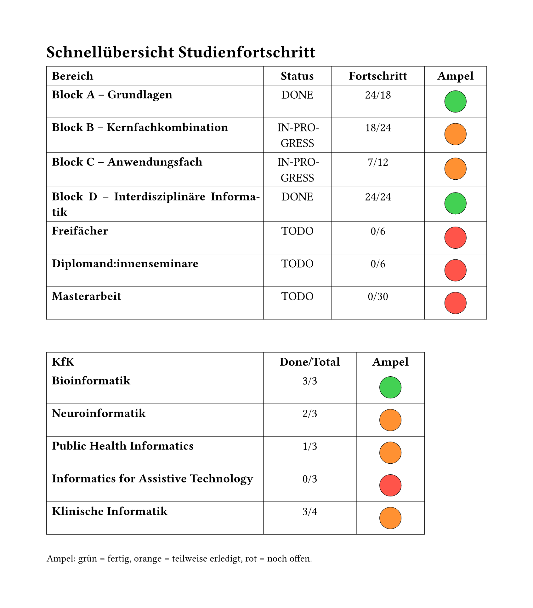
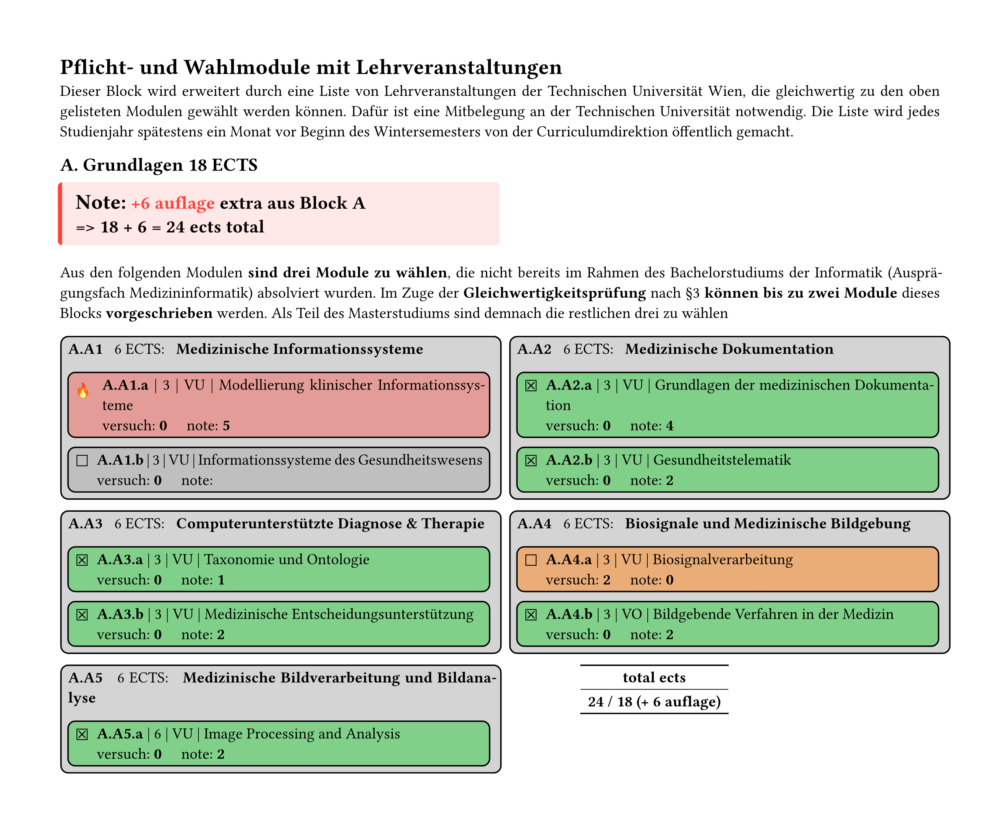
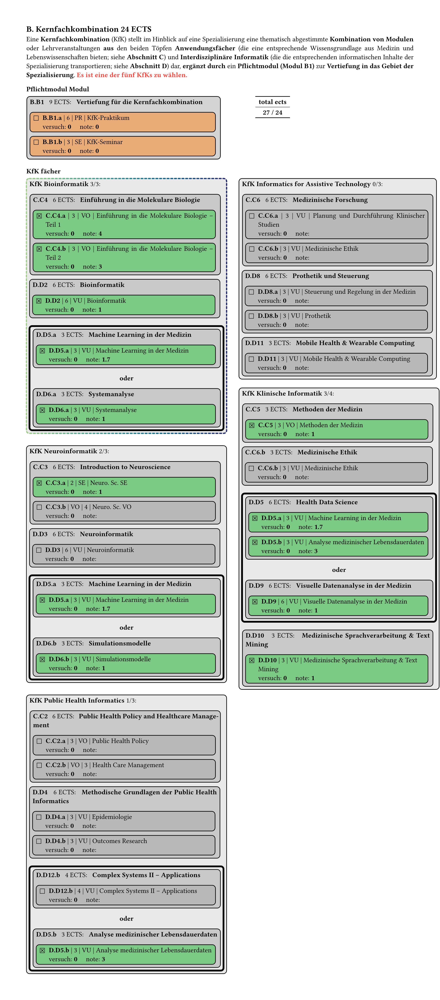

# curricula-med-inf-meduni-wien

> [!WARNING]
>
> Since the Winter Semester 2026, a new curriculum applies to the Master's programme in Medical Informatics.
> Students following the previous curriculum should refer to the repository version immediately preceding
> the following commit, as it is the last version that fully satisfies the requirements
> of the previous study programme:
>
> `xxxxxx`
>

### see: [pdf](./main.pdf)

> [!NOTE]
>
> This repository does **NOT** contain **a study programme plan**.
> It provides a way to **plan your own studies** and export this plan clearly and structurally as a PDF.
>
> To adjust the generated PDF document, please modify the first few lines of the TOML file,
> then use typst.app (locally via CLI or online) to generate the PDF.
>

